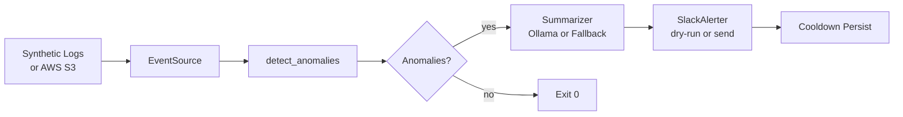

# OpsMitra

OpsMitra is a private AI-assisted log anomaly detector for learning AWS, local model
integration, alerting, and AI-native backend design.

---

## Overview

OpsMitra detects operational anomalies in SaaS-style log events using deterministic
rules, then summarises the evidence with a local/private model (Ollama or fallback),
and delivers Slack-ready alerts — with a dry-run mode on by default.

The pipeline works end-to-end locally before any AWS account is needed, making it
safe to learn with synthetic data first and real cloud data when ready.



The first version is intentionally local-first:

- generate synthetic SaaS logs
- detect anomalies with deterministic rules
- summarize structured evidence with a local/private model
- send Slack-ready alerts (dry-run by default)
- add AWS S3/Athena integration after the local loop works

See the full build plan at [`.claude/plans/opsmitra-build-plan.md`](.claude/plans/opsmitra-build-plan.md).

---

## Quickstart

```bash
git clone <repo-url>
cd opsmitra

# Create and activate a virtual environment
python -m venv .venv
.venv/bin/pip install -e ".[dev]"

# Run the full test suite
.venv/bin/pytest

# Run the evaluation harness against labelled fixtures
.venv/bin/python -m opsmitra eval --dataset tests/fixtures/evaluation

# Run the detector against a 1-hour local window (dry-run, no Slack sent)
.venv/bin/python -m opsmitra run \
  --window-start 2026-06-01T00:00:00Z \
  --window-end   2026-06-01T01:00:00Z \
  --dry-run
```

Exit codes: `0` = no anomalies, `2` = anomalies detected, `1` = runtime error,
`64` = CLI usage error.

---

## Environment Variables

All configuration is via environment variables. Secrets must **never** be
hardcoded — see [`docs/security-checklist.md`](docs/security-checklist.md) for
the secret-handling policy.

### Model

| Name | Default | Purpose |
|------|---------|---------|
| `OPSMITRA_MODEL_PROVIDER` | `fallback` | Summarizer provider: `fallback` (deterministic) or `ollama` |
| `OPSMITRA_MODEL_URL` | `http://localhost:11434` | Base URL for the Ollama-compatible HTTP endpoint |
| `OPSMITRA_MODEL_NAME` | `llama3.1:8b` | Model identifier passed in the generate request |
| `OPSMITRA_MODEL_TIMEOUT` | `10` | Request timeout in seconds (float) |

### Slack

| Name | Default | Purpose |
|------|---------|---------|
| `OPSMITRA_SLACK_WEBHOOK_URL` | *(unset)* | Incoming webhook URL. Required when `OPSMITRA_DRY_RUN=false`. Never logged. |
| `OPSMITRA_DRY_RUN` | `true` | Set to `false` to actually POST to Slack. Defaults to `true` in all environments. |
| `OPSMITRA_SLACK_CHANNEL_OVERRIDE` | *(unset)* | Override the channel in the payload (optional). |
| `OPSMITRA_SLACK_TIMEOUT_SECONDS` | `5.0` | Per-request HTTP timeout for Slack delivery |
| `OPSMITRA_SLACK_MAX_RETRIES` | `3` | Number of retries on 5xx / network errors |
| `OPSMITRA_SLACK_BACKOFF_BASE_SECONDS` | `0.5` | Exponential backoff base delay |
| `OPSMITRA_SLACK_BACKOFF_MAX_SECONDS` | `8.0` | Maximum backoff cap per retry |
| `OPSMITRA_SLACK_TOTAL_WAIT_CAP_SECONDS` | `15.0` | Total wall-clock cap across all retries |

### AWS

| Name | Default | Purpose |
|------|---------|---------|
| `OPSMITRA_EVENT_SOURCE` | `local` | `local` (JSONL files) or `athena` (AWS Athena) |
| `OPSMITRA_EVENT_SINK` | `local` | `local` (JSONL files) or `s3` (S3 gzip sink) |
| `OPSMITRA_AWS_REGION` | `us-east-1` | AWS region for Athena and S3 |
| `OPSMITRA_S3_BUCKET` | *(unset)* | S3 bucket name for event storage |
| `OPSMITRA_S3_PREFIX` | `opsmitra-events` | S3 key prefix (Hive partition root) |
| `OPSMITRA_ATHENA_DATABASE` | `opsmitra` | Glue / Athena database name |
| `OPSMITRA_ATHENA_TABLE` | `events` | Athena table name |
| `OPSMITRA_ATHENA_WORKGROUP` | `primary` | Athena workgroup (set byte-scan cap here) |
| `OPSMITRA_ATHENA_OUTPUT_LOCATION` | *(unset)* | S3 path for Athena query results |

### Detection

| Name | Default | Purpose |
|------|---------|---------|
| `OPSMITRA_THRESHOLDS_PATH` | *(unset)* | Path to a JSON thresholds override file. Schema: `{"default": {...}, "tenants": {...}, "endpoints": {...}}` |

### Runtime

| Name | Default | Purpose |
|------|---------|---------|
| `OPSMITRA_LOG_PATH` | `data/events.jsonl` | Path to local NDJSON event file (local mode) |
| `OPSMITRA_OUTPUT_PATH` | `outputs` | Directory for local output files |
| `OPSMITRA_COOLDOWN_SECONDS` | `3600` | Alert cooldown TTL in seconds (0 = no cooldown) |
| `OPSMITRA_COOLDOWN_PATH` | `./.opsmitra/cooldown.json` | Path to the cooldown state JSON file |
| `OPSMITRA_MAX_EVENTS_PER_WINDOW` | `1000000` | Maximum events fetched per `run` window |

### Evaluation

The evaluation harness uses the same env vars as the runtime (model, alert config)
but bypasses cooldown and Slack delivery. No additional vars are required.

---

## Local Demo Walkthrough

This walkthrough takes you from a fresh clone to seeing a dry-run Slack payload
printed to stdout in about 5 minutes.

### Step 1 — Clone and install

```bash
git clone <repo-url> opsmitra
cd opsmitra
python -m venv .venv
.venv/bin/pip install -e ".[dev]"
```

### Step 2 — Generate synthetic events

Use the built-in generator to produce a JSONL events file with injected anomalies:

```python
# generate_demo.py
from opsmitra.generator import generate_events
import pathlib, json

events = generate_events(
    tenants=["acme", "beta"],
    n_normal=500,
    inject_incidents=True,
    seed=42,
)
pathlib.Path("data").mkdir(exist_ok=True)
with open("data/events.jsonl", "w") as f:
    for e in events:
        f.write(json.dumps(e) + "\n")

print(f"Wrote {len(events)} events to data/events.jsonl")
```

```bash
.venv/bin/python generate_demo.py
```

### Step 3 — Configure for local mode

```bash
export OPSMITRA_EVENT_SOURCE=local
export OPSMITRA_LOG_PATH=data/events.jsonl
export OPSMITRA_DRY_RUN=true         # default; shown explicitly for clarity
```

### Step 4 — Run the detector

```bash
.venv/bin/python -m opsmitra run \
  --window-start 2026-06-01T00:00:00Z \
  --window-end   2026-06-07T00:00:00Z \
  --dry-run
```

### Step 5 — Observe output

When anomalies are found, the dry-run Slack Block Kit payload is printed to stdout:

```json
{
  "text": "OpsMitra Alert: sms_abuse detected for tenant acme",
  "blocks": [ ... ],
  "attachments": [ ... ]
}
```

The process exits with code `2` when at least one anomaly was detected and alerted.
Exit code `0` means no anomalies in the window.

### Step 6 — Run the evaluation harness

```bash
.venv/bin/python -m opsmitra eval \
  --dataset tests/fixtures/evaluation \
  --report table
```

This runs all labelled fixture cases and prints a precision/recall table. Exit
code `0` means all expected anomalies were matched.

---

## Architecture

OpsMitra uses two execution modes (local JSONL and AWS Athena) that share a common
detector + summarizer + alerter pipeline. The runtime orchestrates all stages and
tracks cooldown state to suppress duplicate alerts.

For detailed component diagrams (pipeline flowchart, runtime sequence, evaluation
harness flowchart) see [`docs/architecture.md`](docs/architecture.md).

---

## AWS Deployment

AWS mode replaces `LocalNDJSONEventSource` with `AthenaEventSource` while keeping
the rest of the pipeline identical. Events are stored in S3 using a 5-key Hive
partition layout (`tenant/year/month/day/hour`) and queried with mandatory partition
predicates to control Athena scan costs.

Key references:

- **Cost controls:** [`docs/aws-cost-controls.md`](docs/aws-cost-controls.md) —
  partition strategy, workgroup byte-cap configuration, S3 storage classes, and
  in-process cost-control env vars.
- **Security checklist:** [`docs/security-checklist.md`](docs/security-checklist.md) —
  minimum IAM policy, secret handling, model data exposure boundaries, and
  operational failure modes.
- **Window replay exercise:** [`docs/aws-window-replay.md`](docs/aws-window-replay.md) —
  step-by-step guide for running OpsMitra against a real AWS log window.

AWS mode requires `boto3` (included in the package dependencies) and standard
AWS credentials via environment variables, `~/.aws/credentials`, or an instance
profile. The minimum IAM permissions are documented in
[`docs/security-checklist.md`](docs/security-checklist.md) § IAM.
