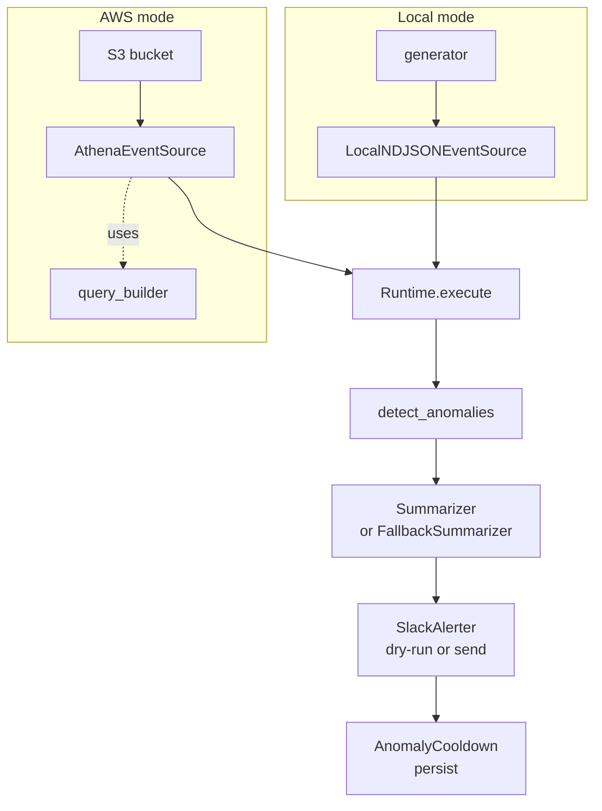
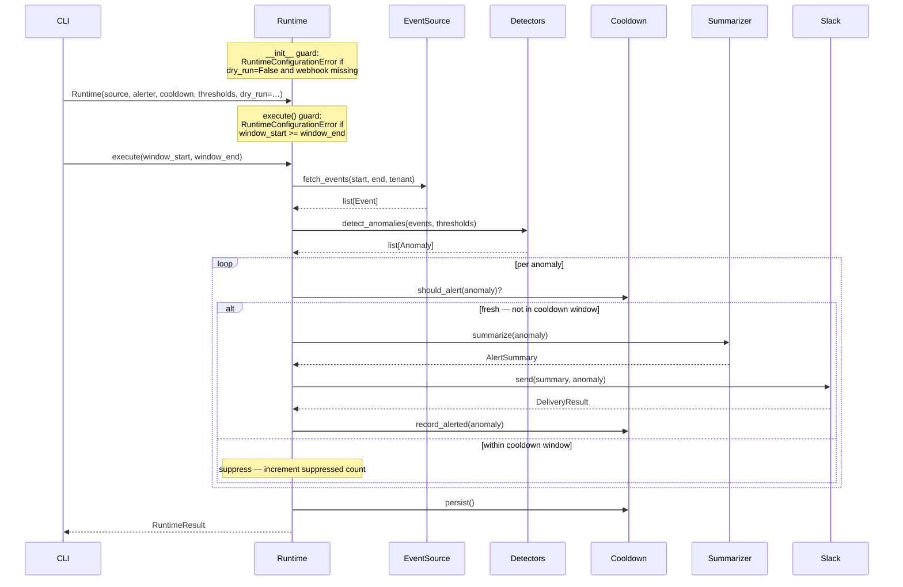
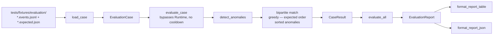

# OpsMitra Architecture

OpsMitra is a private AI-assisted log anomaly detector. Its job is to detect operational anomalies using deterministic code, then use a local/private model to explain the structured evidence in human language.

## Goals

- Learn AWS log/data services with a realistic but safe project.
- Keep logs private by default.
- Build a dependable detector pipeline before adding model summarization.
- Produce Slack-ready alerts with concrete evidence and suggested action.
- Keep local mode fully functional before adding AWS mode.

## Non-Goals

- No production log ingestion in v0.
- No external hosted LLM calls for log analysis.
- No model-only anomaly detection.
- No automatic account disabling, API key revocation, or throttling.
- No full SIEM, APM, or observability platform replacement.

## Core Flow

```text
Synthetic SaaS logs
        |
        v
Local files or S3/Athena
        |
        v
Deterministic detectors
        |
        v
Structured anomaly JSON
        |
        v
Local/private model summarizer
        |
        v
Slack-ready alert
```

## Runtime Modes

### Local Mode

Local mode is the default development path. It reads generated JSONL logs from disk, runs detectors in-process, summarizes anomalies with a local model provider or fallback summarizer, and prints or dry-runs Slack payloads.

Local mode must never require AWS credentials.

### AWS Mode

AWS mode is optional and comes after the local loop works. Generated logs can be uploaded to S3, queried through Athena, and fed into the same detector contracts used locally.

The first AWS target is a scheduled detector run using EventBridge with Lambda or ECS. Lambda is preferred only while runtime and dependency size stay small. ECS is acceptable once local model access, larger dependencies, or long-running jobs make Lambda awkward.

## Components

### Log Generator

Creates deterministic synthetic SaaS events for multiple tenants. It emits normal traffic and injected incidents for SMS/API abuse, auth failure bursts, endpoint error spikes, and cost/runaway usage.

### Event Store

Provides detector input. The first implementation reads local JSONL files. The AWS implementation later queries Athena over partitioned S3 data.

### Detectors

Detectors compare recent windows against known baselines or thresholds. They emit structured anomaly records and do not call the model.

Each detector must be independently testable and deterministic.

### Summarizer

The summarizer receives scoped anomaly evidence and creates a concise alert explanation. It does not receive the full raw log stream.

The first provider should support an Ollama-compatible HTTP API. A deterministic fallback summary must exist for unavailable models.

### Alert Delivery

Slack is the first alert target. Teams is a later extension point. Alert delivery must support dry-run mode and must not log webhook secrets.

## Privacy Boundary

The model boundary is intentionally narrow:

- allowed: anomaly type, counts, baselines, ratios, tenant/API key identifiers, evidence summaries, recommended actions
- disallowed in v0: full raw log windows, secrets, request bodies, authorization headers, customer message bodies

## AWS Shape

```text
Generator or application logs
        |
        v
S3 partitioned data
        |
        v
Athena external table
        |
        v
Scheduled OpsMitra detector
        |
        v
Local/private model endpoint
        |
        v
Slack webhook
```

S3 data should be partitioned by date and hour where practical. Athena queries must include partition filters to control cost.

## Pipeline Diagram (D1)

The diagram below shows both local mode (left branch) and AWS mode (right branch)
feeding into the same `Runtime.execute` pipeline. The two modes share every stage
after the event-source boundary.



## Runtime Sequence (D2)

The sequence diagram traces a single `Runtime.execute` call from CLI invocation
through event fetching, anomaly detection, per-anomaly cooldown gating, summarization,
Slack delivery, and final cooldown persistence.

Validation is two-stage: `Runtime.__init__` raises `RuntimeConfigurationError` if
`dry_run=False` and the Slack webhook URL is absent; `Runtime.execute` raises
`RuntimeConfigurationError` if `window_start >= window_end`. See `runtime.py` for
the implementation.



## Evaluation Harness (D3)

The evaluation harness runs detectors against labelled fixture files without touching
`Runtime`, cooldown, or Slack. The diagram shows data flow from fixture files through
case loading, detection, greedy bipartite matching, and final report generation.



## Failure Handling

- If detector input cannot be read, return a runtime failure exit code.
- If no anomalies are found, return success and send no alert.
- If anomalies are found but model summarization fails, use fallback summaries.
- If Slack delivery fails, log a safe error and return a delivery failure exit code.

## Open Decisions

- Whether AWS runtime should start with Lambda or ECS.
- Whether generated logs should stay JSONL for simplicity or move to Parquet before Athena.
- Whether local model hosting should start on the developer machine or EC2.
